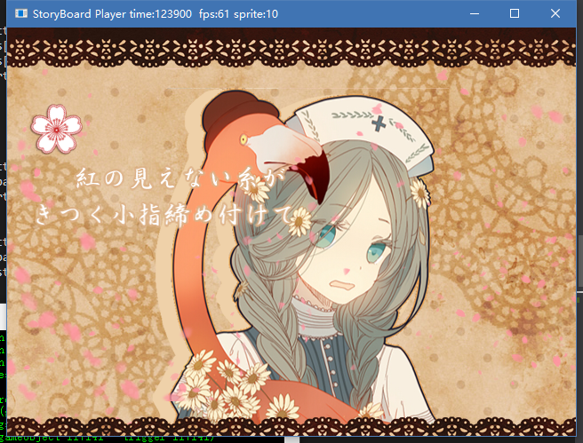
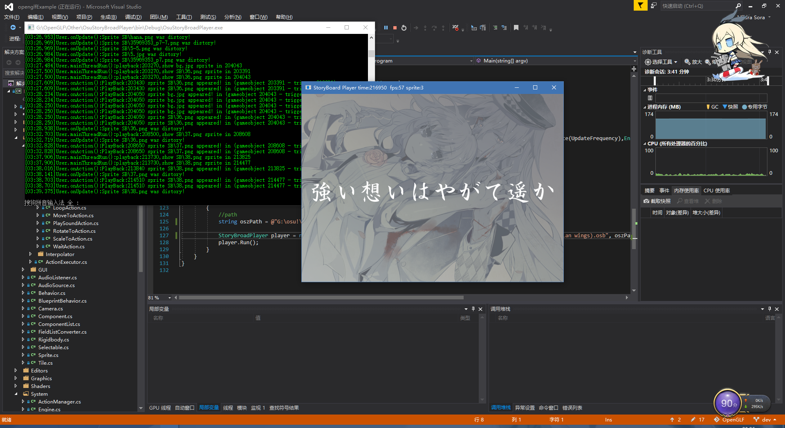
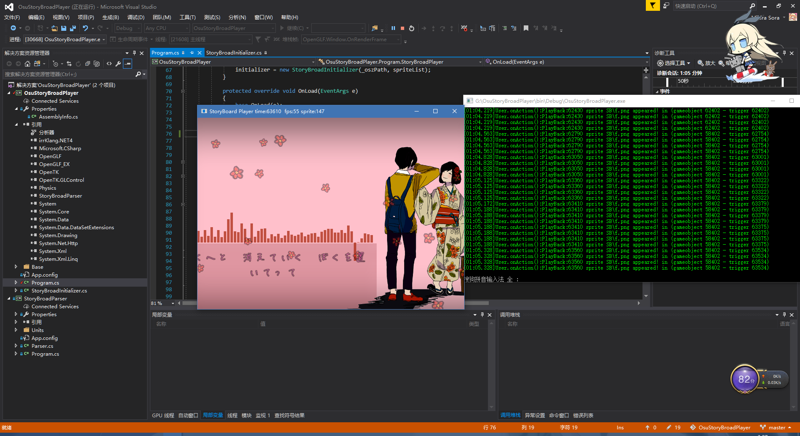
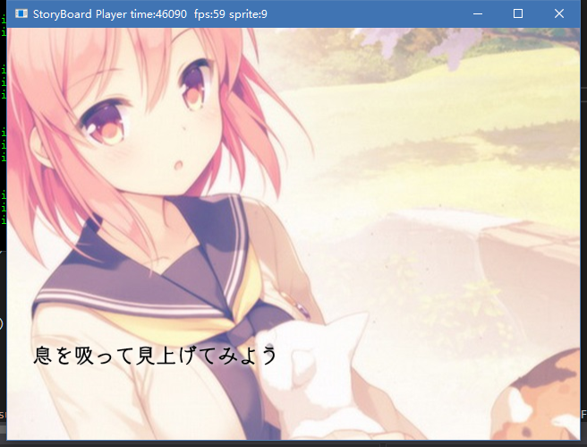

# osu! StoryBoard Player

## Introduce
Base on OpenGLF, it first code for an Action Anime System, but now it stand out!

## Usage
Drag & Drop your Beatmap Folder into this program

## Process
- Basic SB script, but some awesome script may not work(
- Fix error SB and execute them.(Who can tell me the meaning of SB with no `engTime` ...)
- Doing:
  - Trigger Command
  - Loop Command
  - Paramester Command
- Optimize memory

## ScreenShot

## Special Thanks
***麻花***(43size)，鹅苗，外服大师 ，毛毛，量子玫瑰 and all of 恶俗麻婆2857吹比黄图群
